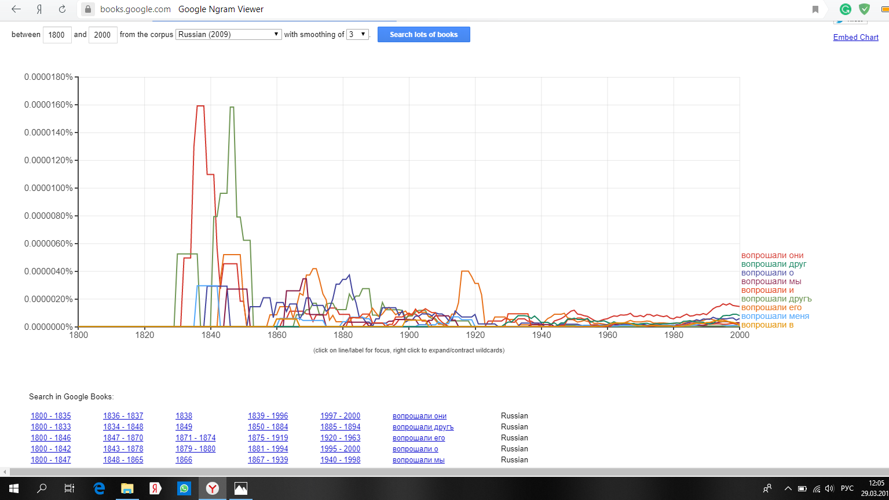

# HW3
Задание 1. AntConc
1) wordlist

2) устаревшие слова

3) N-Grams

4) Collocates

2. Google groups и НКРЯ

а) Для слова "сей":

наиболее часто употреблялось в году:
Google N-Grams - 1808;
НКРЯ - 1802.

наиболее часто употреблялось со словами: 

Google N-Grams:

НКРЯ: 

Синонимы:

НКРЯ:
вхождения для "сей" - 25 787
вхождения для "этот" - 256 752
вхождения для "данный" - 6 918 
ipm - 0,565084663

б) Для слова "доколе":

наиболее часто употреблялось в году:
Google N-Grams - 1814;
НКРЯ - 1800.

наиболее часто употреблялось со словами:

Google N-Grams: 

НКРЯ:

Синонимы:

НКРЯ:
вхождения для "доколе" - 1 264
вхождения для "пока" - 130 694
вхождения для "до тех пор" - 9 266
вхождения для "покуда" - 5 779
ipm - 0, 0025464453

в) Для слова "лобызал":

наиболее часто употреблялось в году:
Google N-Grams - 1817-1823;
НКРЯ - 1801.

наиболее часто употреблялось со словами:

Google N-Grams:

НКРЯ:  

Синонимы:

НКРЯ:
вхождения для "лобызал" - 50
вхождения для "целовал" - 2249
вхождения для "чмокал" - 132
ipm - 0,0000081148

г) Для слова "вопрошали":

наиболее часто употреблялось в году:
Google N-Grams - 1819-1820;
НКРЯ - 1806.

наиболее часто употреблялось со словами:

Google N-Grams:

НКРЯ:  

Синонимы:

НКРЯ:
вхождения для "вопрошали" - 85
вхождения для "спрашивали" - 4 728
вхождения для "узнавали" - 1 057
вхождения для "осведомлялись" - 46

ipm - 0,000022792

3. Использование инструментов корпусного анализа в профессиональной деятельности

До того момента, как мы начали заниматься с НКРЯ на занятиях по цифровой грамотности, я обходила корпус стороной. Мне один раз в жизни пришлось использовать его для поиска контекста слова (для задания по языкознанию), при том корпус мне не очень помог. Откровенно говоря, особой любви даже после разбора на занятиях я к НКРЯ не питаю. Он, конечно, может быть полезен при изучении текстов, так как даёт контексты, случаи и частоту употребления слов, что важно при анализе произведений. Говоря о новизне информации о НКРЯ, то можно сказать, что всё, что давали нам на занятиях, является лично для меня полезным и новым, так как раньше я почти не имела дела с корпусом. Думаю, после этого операции, которые я с трудом пыталась выполнить в начале года, сейчас не вызвали бы у меня затруднений. Скорее всего, в будущем всё же придётся поработать с НКРЯ, но теперь это всё будет гораздо проще и понятнее. 

(задание с семинара от 13.03)

