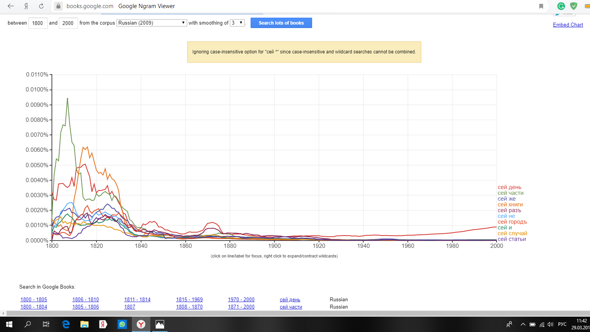

# HW3
Задание 1. AntConc
1) wordlist

2) устаревшие слова

3) N-Grams

4) Collocates

2. Google groups и НКРЯ

Для слова "сей"
наиболее часто употреблялось в году:
Google N-Grams - 1808
НКРЯ - 1802
наиболее часто употеблялось со словами:
Google N-Grams  
НКРЯ  

ipm - 0,565084663

Для слова "доколе"
наиболее часто употреблялось в году:
Google N-Grams - 1814
НКРЯ - 1800
наиболее часто употеблялось со словами:
Google N-Grams 
НКРЯ 
ipm - 0, 0025464453

Для слова "лобызал":
наиболее часто употреблялось в году:
Google N-Grams - 1817-1823
НКРЯ - 1801
наиболее часто употеблялось со словами:
Google N-Grams  
НКРЯ  
ipm - 0,0000081148

Для слова "вопрошали"
наиболее часто употреблялось в году:
Google N-Grams - 1819-1820
НКРЯ - 1806
наиболее часто употеблялось со словами:
Google N-Grams 
НКРЯ  
ipm - 0,000022792

(задание с семинара от 13.03)

